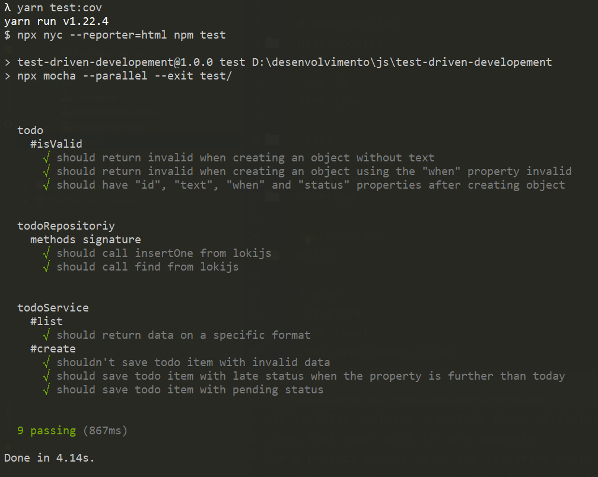
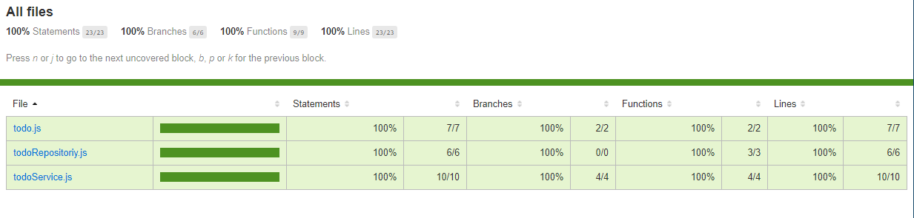

  <a href="#rocket-tecnologias">Tecnologias</a>&nbsp;&nbsp;&nbsp;|&nbsp;&nbsp;&nbsp;
  <a href="#-projeto">Projeto</a>&nbsp;&nbsp;&nbsp;|&nbsp;&nbsp;&nbsp;
  <a href="#-como-rodar">Como rodar</a>&nbsp;&nbsp;&nbsp;|&nbsp;&nbsp;&nbsp;
  <a href="#-como-contribuir">Como contribuir</a>&nbsp;&nbsp;&nbsp;
  

 

# Test Driven development

## 🚀 Tecnologias

Esse projeto foi desenvolvido com as seguintes tecnologias:

- [JavaScript](https://developer.mozilla.org/pt-BR/docs/Web/JavaScript) 
- [NodeJS](https://nodejs.org/en/) - v14.4.0

## 💻 Projeto

Projeto para treinar TDD com Node.js.

Projeto feito acompanhando o canal Erick Wendel [aqui](https://www.youtube.com/watch?v=9COpZuJzx18&t=1200s)

Testes passando.

  

Cobertura de codigo.

  

## 🚀 Como Rodar

 - Clone o projeto.
 - Entre na pasta do projeto e rode o comando "npm install" para instalar as dependências.
 - Rode "npm run dev" para iniciar o servidor.
 - Rode "npm test:cov" para ver a cobertura de testes no codigo.
 - Rode "npm test:dev" para rodar os testes.

## 🤔 Como contribuir

- Faça um fork desse repositório;
- Cria uma branch com a sua feature: `git checkout -b minha-feature`;
- Faça commit das suas alterações: `git commit -m 'feat: Minha nova feature'`;
- Faça push para a sua branch: `git push origin minha-feature`.

Depois que o merge da sua pull request for feito, você pode deletar a sua branch.

## 📝 Licença

Esse projeto está sob a licença MIT.
